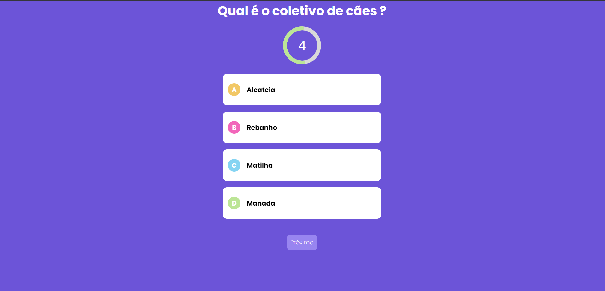

<h1 align="center">Quiz Next</h1>

<p align="center">
  <a href="#-descricao">Descrição</a>&nbsp;&nbsp;&nbsp;|&nbsp;&nbsp;&nbsp;
  <a href="#-demonstração">Demonstração</a>&nbsp;&nbsp;&nbsp;|&nbsp;&nbsp;&nbsp;
  <a href="#-tecnologias">Tecnologias</a>&nbsp;&nbsp;&nbsp;|&nbsp;&nbsp;&nbsp;
  <a href="#-como-executar-backend">Como executar Frontend</a>&nbsp;&nbsp;&nbsp;|&nbsp;&nbsp;&nbsp;
  <a href="#-licença">Licença</a>
</p>

## 📜 Descrição

- Projeto Quiz usando Next js.

## Demonstração



## ✨ Tecnologias

Esse projeto foi desenvolvido com as seguintes tecnologias:

- [Typescript](https://www.typescriptlang.org/)
- [Nextjs](https://nextjs.org/)

## 🎲 Rodando o Projeto

```bash
# Clone este repositório
$ git clone https://github.com/Bruno-Cesar123/quiz_next.git

# Acesse a pasta do projeto no terminal/cmd
$ cd quiz_next

# Instale as dependências
$ npm install ou yarn

# Execute a aplicação em modo de desenvolvimento
$ npm run dev

# O servidor inciará na porta:3000 - acesse <http://localhost:3000>

# Execute a aplicação em produção
$ npm build
$ npm run start

```
- [back-end](https://github.com/Bruno-Cesar123/quiz_next)

Esse projeto está sob a licença MIT. Veja o arquivo [LICENSE](license) para mais detalhes.

---

Feito por **Bruno Cesar** [**LinkedIn**](https://www.linkedin.com/in/bruno-cesar-b0039715a/)